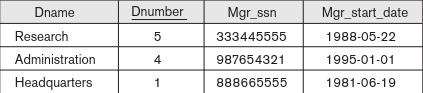
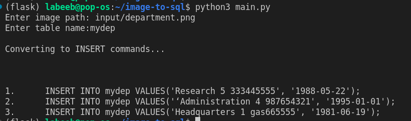
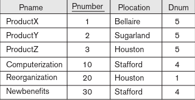
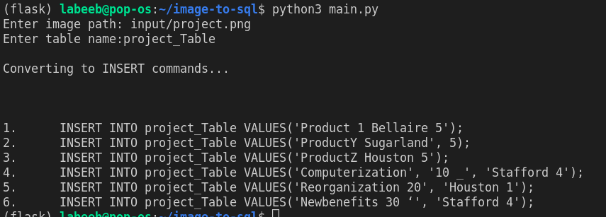

## Image - to - SQL

This repository contains a python script to replicate a table from an image into a SQL database. Build with OpenCV

---

### Examples 

Input : 

Output : 

Input : 

Output : 

